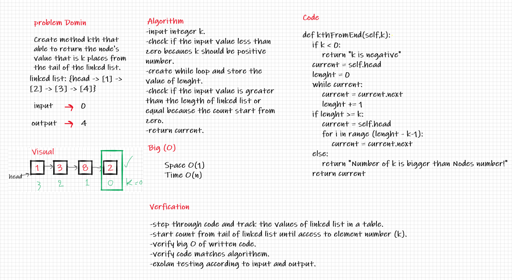

# Code Challenge 5:

## Insert Shift Array

## Challenge:
* Create a Node class that has properties for the value stored in the Node, and a pointer to the next Node. Within LinkedList class, include a head property. Upon instantiation, an empty Linked List should be created.

* Define a method called insert which takes any value as an argument and adds a new node with that value to the head of the list with an O(1) Time performance.

* Define a method called includes which takes any value as an argument and returns a boolean result depending on whether that value exists as a Node’s value somewhere within the list.

* Define a method called toString (or str in Python) which takes in no arguments and returns a string representing all the values in the Linked List, formatted as: "{ a } -> { b } -> { c } -> NULL"

# Code Challenge 6:

## Linked List Insertions

## Challenge:

* Define a method called append which takes any value as an argument and adds a new node with the given value to the end of the list.

* Define a method called insert before which takes any value as an argument and adds a new node with the given new value immediately before the first node that has the value.

* Define a method called insert after which takes any value as an argument and adds a new node with the given new value immediately after the first node that has the value specified.

# Code Challenge 7:

## Linked List kth

## Challenge:

* Define a method called kthFromEnd which takes any value as an argument a number, k, as a parameter.

* Define a method called kth which takes any value as an argument and Return the node’s value that is k places from the tail of the linked list.

## Approach & Methodology:

