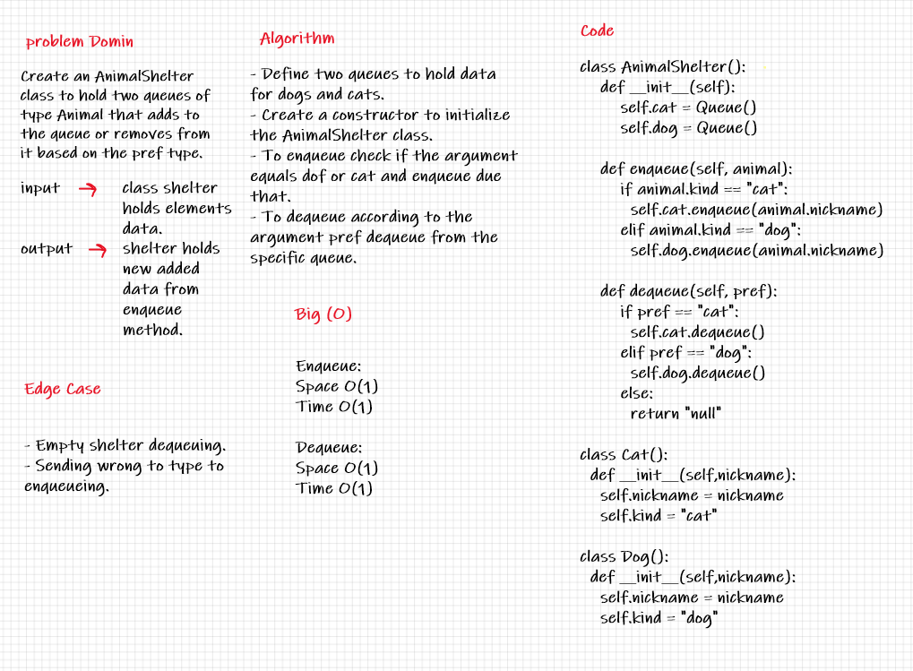

# Code Challenge 12:

## Stack Queue Animal Shelter

## Challenge:
* Create a Create a class called AnimalShelter which holds only dogs and cats.

* The shelter operates using a first-in, first-out approach.

* Methods:
    * enqueue:
      - Arguments: animal.
      - animal can be either a dog or a cat object.
    
    * dequeue:
      - Arguments: pref.
      - pref can be either "dog" or "cat".
      - Return: either a dog or a cat, based on preference.
      - If pref is not "dog" or "cat" then return null.

## Approach & Methodology:

