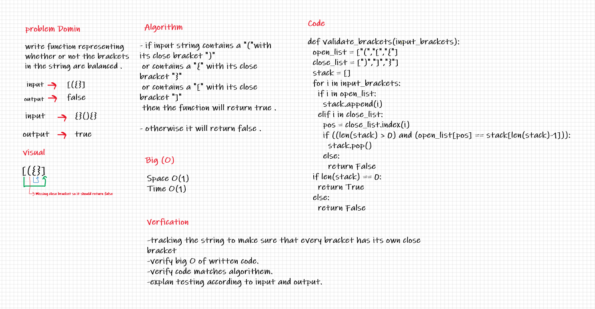

# Code Challenge 13:

## Stack Queue Brackets

## Challenge:
* Write a function called validate brackets which takes one string argument and should return a boolean representing whether or not the brackets in the string are balanced.

* Representing whether or not the brackets in the string are balanced.

* There are 3 types of brackets:
    * Round Brackets : ()
    * Square Brackets : []
    * Curly Brackets : {}

## Approach & Methodology:

## Tasks:
    - [x] Top-level README “Table of Contents” is updated
    - [x] Feature tasks for this challenge are completed
    - [x] Unit tests written and passing
    - [x] “Happy Path” - Expected outcome
    - [x] Expected failure
    - [x] Edge Case (if applicable/obvious)
    - [x] README for this challenge is complete
    - [x] Description, Approach & Efficiency, Solution
    - [x] Link to code
