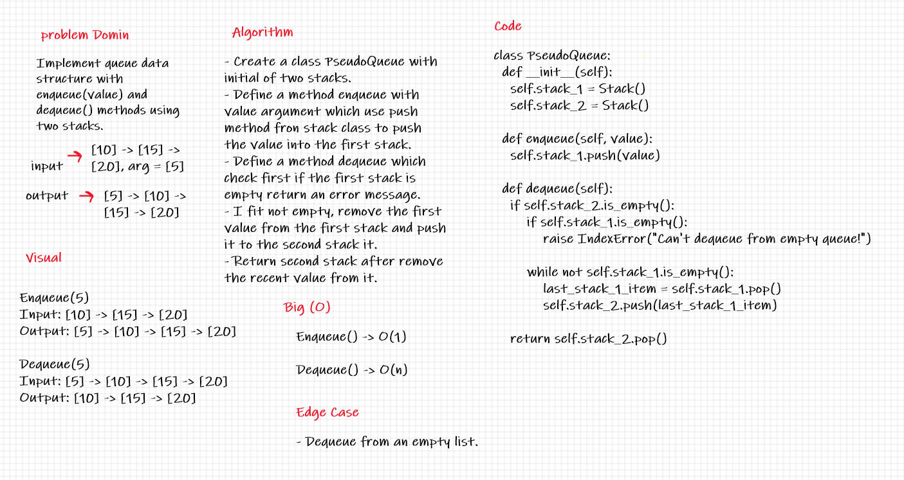

# Code Challenge 11:

## Stack Queue Pseudo

## Challenge:
* Create a new class called pseudoQueue.

* This PseudoQueue class will implement our standard queue interface (the two methods listed below),.

* Methods:
    * enqueue.
    * dequeue.

## Approach & Methodology:

