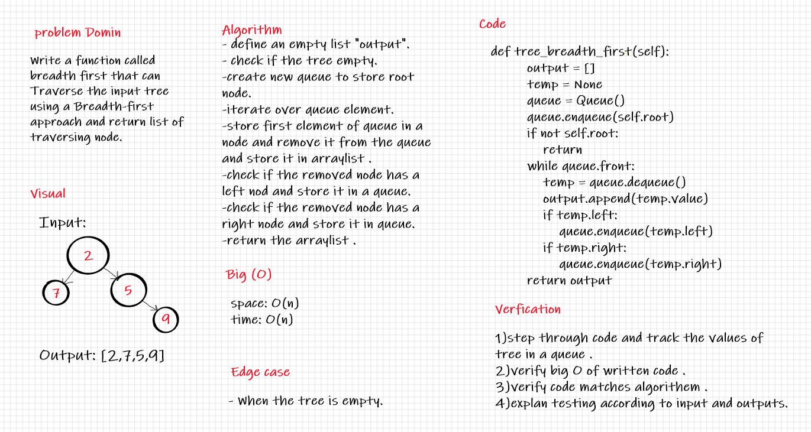

# Code Challenge 17

## Breadth-first Traversal

## Challenge

* Write a function called breadth first:
    * Arguments: tree.
    * Returns: list of all values in the tree, in the order they were encountered.

## Approach & Efficiency
* **Big (O)**:
  - Time --> O(n)
  - Space --> O(n)

## Approach & Methodology:

