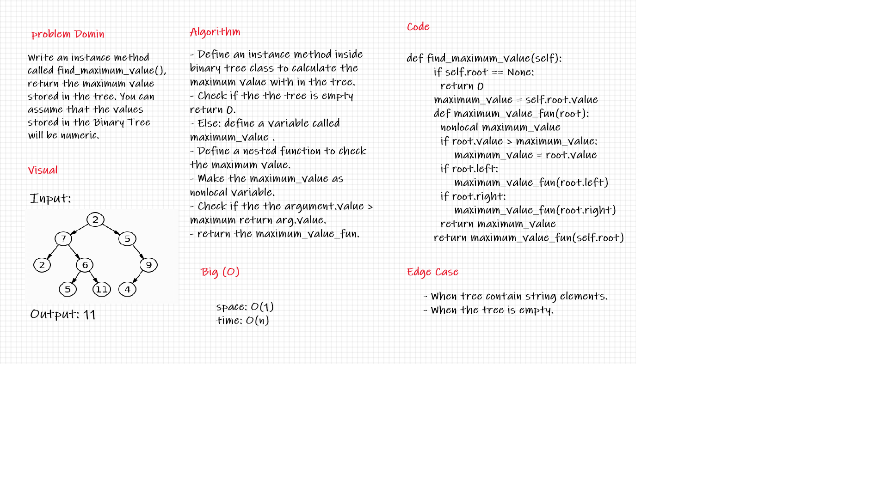

# Code Challenge 15

## Binary Tree and BST Implementation

## Challenge
 * **Node**:
 
  * Create a Node class that has properties for the value stored in the node, the left child node, and the right child node.

 * **Binary Tree**:
 
  * Create a Binary Tree class.
  
  * Define a method for each of the depth first traversals:
    * preOrder() return an array of collection from a pre-order depth first traversal >> [root][left][right]
    * inOrder() return an array of collection from a in-order depth first traversal >> [left][root][right]
    * postOrder() return an array of collection from a post-order depth first traversal >> [left][right][root]

 * **Binary Search Tree**:
 
  * Create a Binary Search Tree class.
  
  * This class should be a sub-class (or your languages equivalent) of the Binary Tree Class, with the following additional methods:
    
    * Add(value): accepts a value, and adds a new node with that value in the correct location in the binary search tree.

    * Contains(value): accepts a value, and returns a boolean indicating whether or not the value is in the tree at least once.

## Approach & Efficiency
* **Big (O)**:
  - Time --> O(n)
  - Space --> O(1)

---------------------------------------------------------------------------------------------------

# Code Challenge 16

## Maximum Value in a Binary Tree

## Challenge

* Write the following method for the Binary Tree class.
  
* Find maximum value:
    * Arguments: none.
    * Returns: number.
    * Find the maximum value stored in the tree. You can assume that the values stored in the Binary Tree will be numeric.

## Approach & Efficiency
* **Big (O)**:
  - Time --> O(n)
  - Space --> O(1)

## Approach & Methodology:

